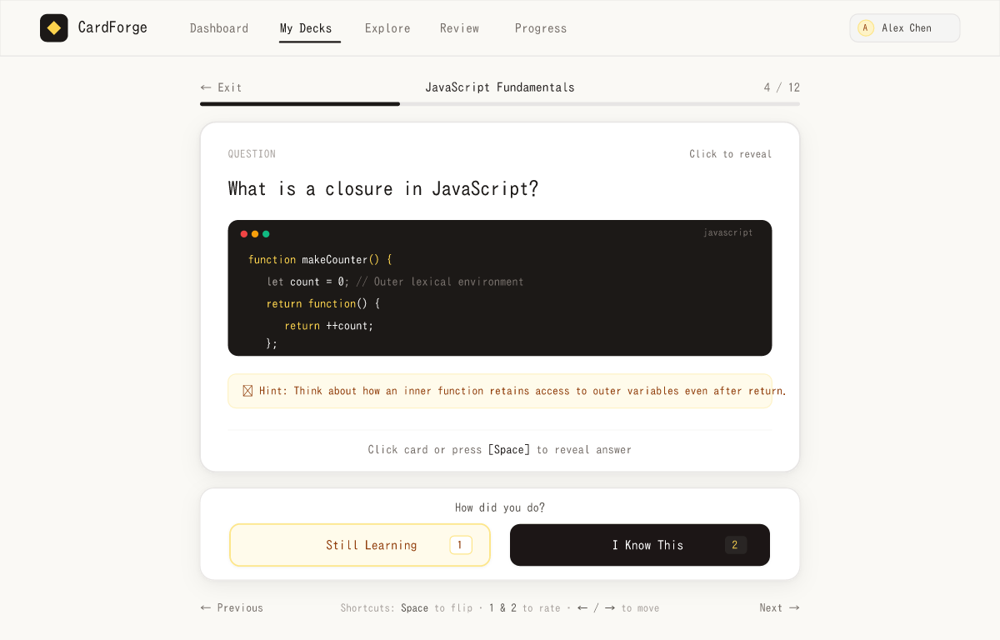
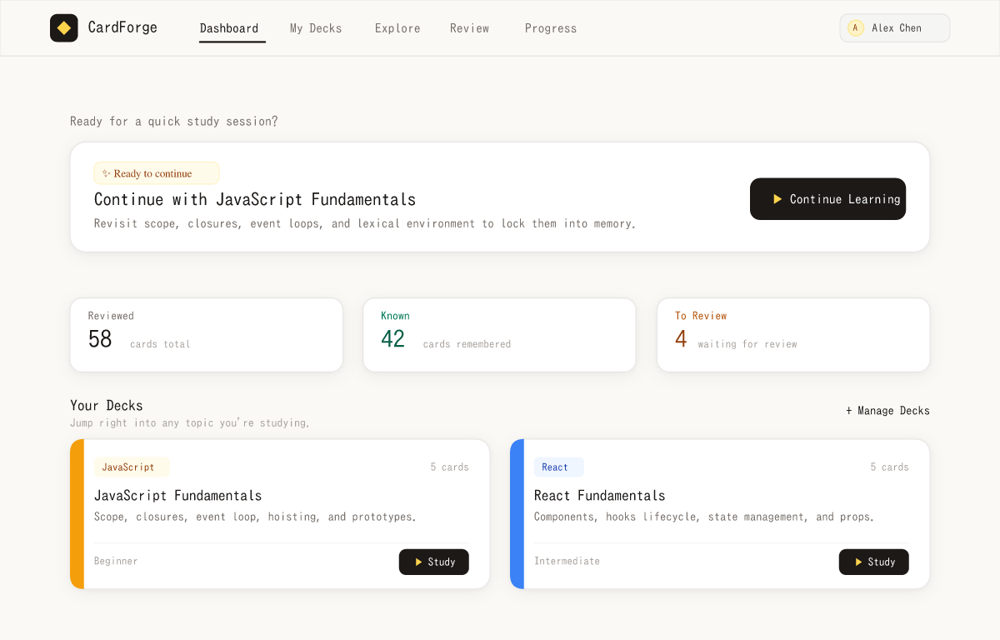
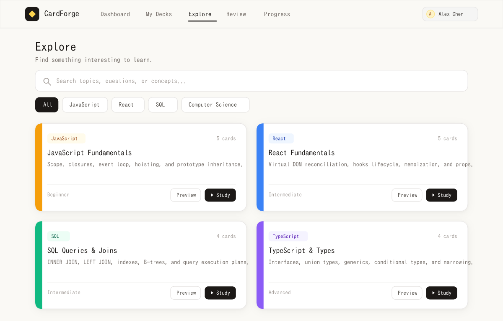

# CardForge — Student-First Flashcard Platform

<p align="center">
  <strong>"Learning doesn't have to feel complicated." Master complex concepts with distraction-free active recall and intelligent spaced repetition.</strong>
</p>

<p align="center">
  
  
  
  
  
  
  
</p>

---

## 📸 Application Previews

### 1. Focused Study Mode (Active Recall with 3D Flip)
Distraction-free learning screen featuring smooth 3D card flips, readable typography with Plus Jakarta Sans & Inter, dark JetBrains Mono code snippets, collapsible hints, and intuitive `[1]` / `[2]` recall evaluation.

<p align="center">
  
</p>

---

### 2. Action-First Student Dashboard
Answers *"What should I do next?"* with a primary Continue Learning focal point, honest progress breakdown (Reviewed, Known, To Review), and recognizable deck cards with subtle category accents.

<p align="center">
  
</p>

---

### 3. Explore & Decks Catalog
Searchable collection of foundational topics across JavaScript, React, SQL, and Computer Science with clean category filters and quick-study actions.

<p align="center">
  
</p>

---

## ✨ Key Features

- **🎯 Distraction-Free Active Recall**: Study one card at a time with smooth 3D CSS perspective card flips, progress tracking, and session accuracy scores.
- **⌨️ Hands-On-Keyboard Navigation**: Full keyboard shortcut support (`[Space]` to flip, `[1]` to review again, `[2]` to mark known, arrow keys for navigation, `[H]` for hints).
- **🧠 SuperMemo (SM-2) Spaced Repetition**: Adaptive algorithm that dynamically calculates card review intervals ($1\text{d} \to 3\text{d} \to 7\text{d}$) and ease factors based on individual recall confidence.
- **💻 Technical Code Snippet Support**: Built-in monospace code presentation blocks with language indicators and one-click clipboard copying.
- **📊 Real-Time Analytics & Streak Tracking**:
  - Daily consistency streak counter with flame indicator.
  - Interactive 7-Day study volume chart.
  - Categorized knowledge retention distribution (Mastered, Known, In Review).
  - Recent study session audit log with accuracy badges.
- **📚 Curated Technical Interview Seed Decks**: Automatically bootstraps comprehensive decks for JavaScript Core, React Reconciliation & Hooks, SQL Optimization, and TypeScript Generics.
- **🛠️ Custom Deck & Card Management**: Full CRUD interface for creating custom decks, adding cards with questions, answers, code snippets, hints, and explanations.
- **🔐 Secure Authentication**: JWT Bearer token authentication with bcrypt password hashing, protected routes, and instant guest deck exploration.

---

## ⌨️ Keyboard Shortcuts (Study Mode)

| Key | Action | Description |
| :--- | :--- | :--- |
| `Space` | **Flip Card** | Rotates between Question and Answer faces |
| `1` | **Review Again** | Marks card as "Learning" and queues it for reinforcement |
| `2` | **I Know This** | Marks card as "Known", increasing its spaced repetition interval |
| `→` or `J` | **Next Card** | Navigates forward |
| `←` or `K` | **Previous Card** | Navigates backward |
| `H` | **Toggle Hint** | Reveals front-side hints when you're stuck |

---

## 🧮 Spaced Repetition Algorithm (SM-2)

CardForge uses an adapted SuperMemo SM-2 algorithm to schedule review intervals:

1. **Successful Recall (`I Know This`)**:
   $$\text{Interval}_1 = 1 \text{ day}, \quad \text{Interval}_2 = 3 \text{ days}$$
   $$\text{Interval}_n = \text{round}(\text{Interval}_{n-1} \times \text{EaseFactor}) \quad (n \ge 3)$$
   Cards graduate to **Mastered** status once successfully recalled 3 consecutive times.

2. **Missed Recall (`Review Again`)**:
   - Repetition count resets to `0`.
   - Review interval resets to `1 day`.
   - Ease factor decreases: $\text{EaseFactor} = \max(1.3, \text{EaseFactor} - 0.2)$.
   - The card enters the active **Review Queue** (`/review`) for immediate reinforcement.

---

## 🏗️ Architecture & Tech Stack

```text
├── server/                     # Backend Express REST API
│   ├── config/                 # Database connection & seed data
│   │   ├── db.ts               # Mongoose Atlas connection manager
│   │   └── seedData.ts         # Technical interview seed decks
│   ├── controllers/            # Request handlers
│   │   ├── authController.ts   # Registration, login, profile
│   │   ├── deckController.ts   # Deck CRUD & explore filters
│   │   ├── cardController.ts   # Card CRUD & ordering
│   │   └── studyController.ts  # Session tracking & SM-2 review queue
│   ├── middleware/             # Express middlewares (auth token verification)
│   ├── models/                 # Mongoose Data Models
│   │   ├── User.ts             # User credentials & profile
│   │   ├── Deck.ts             # Decks (user-created & system seeds)
│   │   ├── Card.ts             # Flashcard questions, answers, snippets
│   │   ├── StudySession.ts     # Completed study logs & accuracy
│   │   └── CardProgress.ts     # SM-2 intervals & next review dates
│   └── routes/                 # Express API Route modules
├── src/                        # Frontend React Application
│   ├── components/             # Reusable UI components
│   │   ├── Navbar.jsx          # Header navigation & user status
│   │   ├── Footer.jsx          # Professional footer
│   │   ├── CardPreview.jsx     # Interactive landing hero card preview
│   │   └── ProtectedRoute.jsx  # Route guards for authenticated views
│   ├── context/                # React context providers (AuthContext)
│   ├── pages/                  # Page Views
│   │   ├── LandingPage.jsx     # Clean product homepage
│   │   ├── DashboardPage.jsx   # Metrics, 7-day chart & recent sessions
│   │   ├── DecksPage.jsx       # Personal decks manager (Create/Edit)
│   │   ├── DeckDetailPage.jsx  # Card management table & snippet editor
│   │   ├── ExplorePage.jsx     # Curated technical decks catalog
│   │   ├── StudyPage.jsx       # 3D focus study mode & live evaluation
│   │   ├── ReviewPage.jsx      # Spaced repetition due cards queue
│   │   ├── LoginPage.jsx       # Authentication sign-in
│   │   └── RegisterPage.jsx    # User registration
│   ├── services/               # API client service layer (fetch wrappers)
│   └── App.tsx                 # Main application routes & layout
├── server.ts                   # Unified full-stack server entry point
├── package.json                # Dependencies & npm scripts
└── tsconfig.json               # TypeScript compiler configuration
```

---

## 📡 REST API Reference

### Authentication (`/api/auth`)
- `POST /api/auth/register` — Create a new developer account.
- `POST /api/auth/login` — Sign in and receive a JWT Bearer token.
- `GET /api/auth/me` — Retrieve current authenticated user profile.

### Decks (`/api/decks`)
- `GET /api/decks` — List decks (supports `?filter=my-decks` or `?filter=explore` and `?category=...`).
- `GET /api/decks/:id` — Fetch deck details and metadata.
- `POST /api/decks` — Create a new custom deck.
- `PUT /api/decks/:id` — Update deck title, category, or description.
- `DELETE /api/decks/:id` — Delete deck and cascade delete its flashcards.

### Cards (`/api/cards` & `/api/decks/:deckId/cards`)
- `GET /api/decks/:deckId/cards` — Retrieve all flashcards in a deck.
- `POST /api/decks/:deckId/cards` — Add a new flashcard (question, answer, snippet, hint).
- `PUT /api/cards/:cardId` — Edit flashcard content.
- `DELETE /api/cards/:cardId` — Delete a flashcard.

### Study & Spaced Repetition (`/api/study`)
- `POST /api/study/session` — Record a completed study session and update SM-2 card intervals.
- `GET /api/study/stats` — Retrieve overall cards studied, mastery rates, streak, and 7-day activity.
- `GET /api/study/review-queue` — Retrieve all cards due today for spaced repetition reinforcement.

---

## 🚀 Getting Started

### Prerequisites
- **Node.js**: v18.0.0 or higher
- **MongoDB**: Local MongoDB instance or free [MongoDB Atlas](https://www.mongodb.com/atlas) cluster

### 1. Clone & Install Dependencies
```bash
git clone https://github.com/ChanderValasai/cardforge.git
cd cardforge
npm install
```

### 2. Configure Environment Variables
Copy the example environment file and configure your credentials:
```bash
cp .env.example .env
```

Update `.env` with your settings:
```env
PORT=3000
MONGODB_URI=mongodb+srv://<username>:<password>@cluster0.mongodb.net/cardforge?retryWrites=true&w=majority
JWT_SECRET=your_super_secret_jwt_key_here
```

> **Note**: If `MONGODB_URI` is not set, CardForge connects automatically to `mongodb://localhost:27017/cardforge`.

### 3. Start Development Server
```bash
npm run dev
```

The unified full-stack server starts on **http://localhost:3000** with Vite frontend middleware mounted in Express.

### 4. Build for Production
```bash
npm run build
npm start
```

---

## 🧪 Testing Credentials (Quick Start)

To test the application immediately without registration:
- **Email**: `alex.test@example.com`
- **Password**: `password123`

---

## 📄 License

This project is licensed under the [MIT License](LICENSE). Built for software engineers committed to continuous learning.
